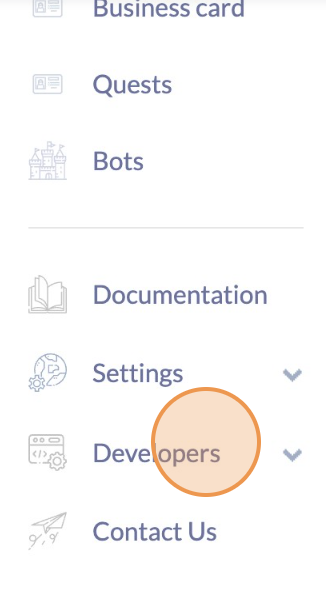
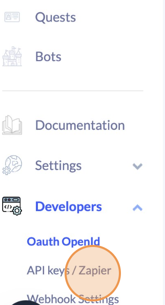

# Getting started with self hosted Map

To have your map self hosted you need to follow these steps :

Start by [creating a GitHub account](https://github.com/join) if you don't already have one.

Go to the [Github map starter kit repository page](https://github.com/workadventure/map-starter-kit) and click the **"Use this template"** button.

You will be prompted to enter a repository name for your map.

### Installation

This package is designed to help you upload maps from Tiled to the map storage of WorkAdventure or your own server.

To install this package, use the following command :

    npm install @workadventure/upload-maps

In order to use this package run the command in your terminal :

    node_modules/.bin/upload-wa-map

It will ask you some questions :

1. Your API Key :
   You can find it on [Your admin acount](https://admin.workadventu.re), you need to log-in and you'll see on the left panel that you can go to Developers tab --> API keys /Zapier. There you can create a new token. (Don't forget to save it !)

2. The URL of your map storage :
   The map storage is in the same section as the API Key above. There are 3 links be careful to take the `Map-storage API endpoint`, it is the url for uploading map storage

   
   

3. Directoy :
   You can also add a `directory name` if you want. It will be the folder where all your uploaded files will be stored in.
   If you leave this blank, there will be no directory.

<!-- 4. Upload Mode :
   The upload mode is the way you want to host your map. If your following this tutorial it mean you want to be hosted so you need to enter 1 to choose this mode of storage.
   If you have any doubt about your upload mode you can check here for the others options.
   [Build your Map with Tiled](index.md) -->

To complete the upload, you need to set your secrets variables in your github repository. You need to set the URL of your map storage and your API Key to push your new release ! You can find here a tutoriel on how to set up your secrets variables in github.

[How to set your secrets in github](https://scribehow.com/shared/Upload_Map__Set_up_secrets_for_in_your_repository__FKsqAsrVQ_SzDavSudb19Q)

After answering these questions, the script will start to upload your directory. To be sure that it worked, you need to see something like this in your terminal : 'Upload done successfully'

Now for every change you only just have to commit and push all your changes ! Just wait a few minutes, and your map will be propagated automatically on your server.

## Customizing your map

### Loading the map in Tiled

The sample map is in the file `map.json`. You can load this file in [Tiled](https://www.mapeditor.org/).

Now, it's up to you to edit the map and write your own map.

Some resources regarding Tiled:

- [Tiled documentation](https://doc.mapeditor.org/en/stable/manual/introduction/)
- [Tiled video tutorials](https://www.gamefromscratch.com/post/2015/10/14/Tiled-Map-Editor-Tutorial-Series.aspx)

### Testing your map locally

In order to test your map, you need a web server to host your map. The "map starter kit" comes with a local web server that you can use to test your map.

In order to start the web server, you will need [Node.JS](https://nodejs.org/en/). When it is downloaded, open your command line and from the directory of the map, run this command:

    $ npm install

This will install the local web server.

    $ npm run start

This command will start the web server and open the welcome page. You should see a page looking like this:

From here, you simply need to click the "Test this map" button to test your map in WorkAdventure.

:::warning
The local web server can only be used to test your map locally. In particular, the link will only work on your computer. You cannot share it with other people.
:::

## Testing your map

To test your map, you need to find its URL. There are 2 kinds of URLs in WorkAdventure:

- Test URLs are in the form `https://play.workadventu.re/_/[instance]/[server]/[path to map]`
- Registered URLs are in the form `https://play.workadventu.re/@/[organization]/[world]/[map]`

Assuming your JSON map is hosted at "`https://myuser.github.io/myrepo/map.json`", then you can browse your map at "`https://play.workadventu.re/_/global/myuser.github.io/myrepo/map.json`". Here, "global" is a name of an "instance" of your map. You can put anything instead of "global" here. People on the same instance of the map can see each others. If 2 users use 2 different instances, they are on the same map, but in 2 parallel universes. They cannot see each other.

This will connect you to a "public" instance. Anyone can come and connect to a public instance. If you want to manage invitations, or to perform some moderation, you will need to create a "private" instance. Private instances are available in "pro" accounts.

## Need some help?

WorkAdventure is a constantly evolving project and there is plenty of room for improvement regarding map editing.
If you are facing any troubles, do not hesitate to seek help in [our Discord server](https://discord.gg/G6Xh9ZM9aR) or open an "issue" in the [GitHub WorkAdventure account](https://github.com/thecodingmachine/workadventure/issues).
